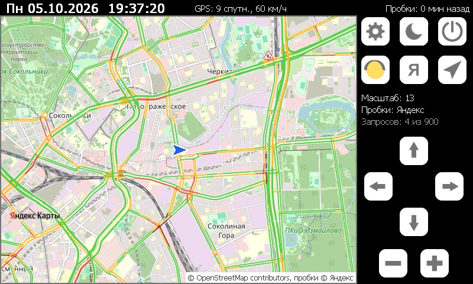

# OSMapsCE

Карта [OpenStreetMap](https://www.openstreetmap.org) с пробками на штатной ММС Lada Vesta
(Windows CE 6.0, экран 800×480). Одна программа без Python, MortScript и альтернативных оболочек.
Пробки берутся у Яндекса или 2ГИС и накладываются на карту прозрачным слоем.

## Возможности
- Подложка OpenStreetMap; плитки кэшируются на SD-карте, просмотренные места открываются без интернета.
- Пробки вкл/выкл; источник пробок переключается кнопкой «Я» / «2Г» (видна, только когда пробки включены):
  - **Яндекс** — без ключа;
  - **2ГИС** — без ключа, в городах 2ГИС (более 200 городов России, Казахстана и других стран); город определяется по центру карты;
- Пробки обновляются раз в 10 минут и на карту памяти не сохраняются.
- Три режима GPS (кнопка со стрелкой, по кругу):
  - **выкл** (перечёркнутая стрелка) — карта стоит, по ней едет значок машины;
  - **север вверх** — центр карты на машине;
  - **по курсу** — карта повёрнута по направлению движения, машина у нижнего края.
- Карту можно перетаскивать пальцем, тап по карте — обновить пробки (не чаще раза в минуту).
- Если плитки нужного масштаба нет, а скачать нельзя, показывается более крупная плитка из кэша.
- Суточные лимиты запросов для каждого источника пробок.
- Ночная карта (кнопка с месяцем): светлый фон становится тёмным, подписи светлыми, цвета пробок сохраняются; запоминается (`night` в ini).
- Экран настроек (шестерёнка): порт и скорость GPS, поиск порта, размер кэша, живой статус NMEA.

## Установка
1. Скачать архив из [Releases](../../releases) и распаковать в корень SD-карты: должна получиться папка `\SDMMC\OSMapsCE`.
2. Запустить `OSMapsCE.exe` (вручную или через AppLauncher).

При первом запуске рядом создаются `OSMapsCE.ini` (настройки), `OSMapsCE.log` (лог) и папка `Cache`.
ГУ при каждой загрузке сбрасывает реестр, но программе ничего устанавливать не нужно.

## GPS
На Весте координаты приходят от блока ЭРА-ГЛОНАСС по CAN, оболочка ГУ выдаёт их в COM-порт
(по умолчанию `COM6:`, 115200), где вместе с NMEA идут и другие данные. Программа читает этот порт
только на чтение, не меняя его настроек (кроме скорости, если она отличается), и выбирает из потока
строки NMEA. Если порт занят Навигатором СитиГИД, программа закрывает его (`kill=` в ini).

Проверить можно в настройках: счётчик «NMEA: N строк» должен расти.
- Строк нет — не тот порт: выберите другой или нажмите «Поиск GPS».
- Много строк с ошибкой — не та скорость.

## Настройки (`OSMapsCE.ini`)
Большинство меняется кнопками, остальное — в файле (при закрытой программе).

| Ключ | По умолчанию | Описание |
|---|---|---|
| `zoom`, `traffic`, `follow` | 13, 1, 1 | масштаб, пробки, режим GPS (0 выкл, 1 север, 2 курс) |
| `traffic_src` | yandex | источник пробок: yandex / 2gis |
| `traffic_ttl` | 10 | через сколько минут обновлять пробки |
| `yandex_limit`, `2gis_limit` | 900, 2000 | максимум запросов пробок в сутки для каждого источника |
| `auto_reserve` | 100 | автоматические обновления останавливаются на `лимит − auto_reserve`, остаток — для ручных действий |
| `cache_mb` | 500 | размер кэша карты на SD, МБ (в настройках: 250 / 500 / 1000 / 2000) |
| `cache_days` | 7 | плитки карты старше стольких дней сверяются с сервером (0 — никогда): если плитка не изменилась, OSM отвечает «304» без картинки и она не скачивается заново; дата берётся из GPS |
| `gps`, `gps_port`, `gps_baud` | 1, COM6:, 115200 | GPS вкл/выкл, порт, скорость (0 — не менять) |
| `kill` | CityGuideCE.exe | программа, которую закрыть, если она держит порт GPS (пусто — никогда) |
| `hide_taskbar` | 1 | скрывать панель задач |

`req_day`, `yandex_count`, `2gis_count`, `osm_count`, `cache_kb` — служебные счётчики, менять не нужно.

## Правила источников
- **OpenStreetMap** ([правила использования плиток](https://operations.osmfoundation.org/policies/tiles/)):
  плитки загружаются только по HTTPS с собственным именем программы, хранятся в кэше,
  массовая и офлайн-выкачка запрещены; на карте всегда видна подпись «© OpenStreetMap contributors».
  Данные OSM распространяются по лицензии [ODbL](https://www.openstreetmap.org/copyright).
- **Яндекс**: пробки берутся из Static API без ключа; при регулярном превышении суточного лимита
  доступ блокируется без восстановления. Ознакомьтесь с
  [условиями бесплатного использования](https://yandex.ru/dev/commercial/doc/ru/) API Яндекс Карт.
- **2ГИС**: публичного API для растровых пробок нет. Программа берёт плитки с того же сервера, что и
  открытая библиотека 2ГИС [RasterJS API](https://github.com/2gis/mapsapi) (слой `DG.Traffic`), поэтому
  адрес может измениться без предупреждения. Использование — только некоммерческое, в бесплатном
  общедоступном приложении, по [лицензионному договору 2ГИС](https://github.com/2gis/mapsapi/blob/master/LICENSE).

## Если что-то не так
- Смотрите `OSMapsCE.log`: запросы, ошибки сети и HTTPS, состояние GPS и кэша. Лог ограничен 256 КБ,
  предыдущая часть сохраняется в `OSMapsCE.old.log`.
- «Ошибка HTTPS» — не удалось установить защищённое соединение (например, неверная дата и нет сигнала GPS).
- Удалите `OSMapsCE.ini`, чтобы вернуть настройки по умолчанию; папку `Cache` можно удалить целиком.

## Сборка из исходников
Исходники в [native_osm](native_osm) (C++, Win32 API). Нужна Visual Studio 2005 Professional
с поддержкой Smart Device и SDK Pocket PC 2003.

Сторонние библиотеки:
- [BearSSL](https://bearssl.org) 0.6 (MIT) в `third_party/bearssl-0.6` — HTTPS;
- [stb_image](https://github.com/nothings/stb) (public domain) — PNG/JPEG.

Сборка:
1. `native_osm\build_bearssl.bat` — один раз, собирает BearSSL для ARM и x86.
2. `native_osm\build.bat` — собирает `OSMapsCE\OSMapsCE.exe` (ARMv4, Windows CE) и `OSMapsCE\OSMapsPC.exe`
   (версия для Windows, чтобы проверять на компьютере; стрелки, `+`/`-`, `T` пробки, `L` источник пробок, `G` GPS, `S` настройки).
3. `native_osm\make_ta.py` — пересоздать встроенные корневые сертификаты (`trust_anchors.inc`) из набора CA,
   если сервер сменит удостоверяющий центр.
4. `native_osm\make_regions.py` — пересоздать таблицу городов 2ГИС (`regions_2gis.inc`) из Catalog API 2ГИС;
   нужен ключ 2ГИС в `native_osm\.env` (`2gis = <ключ>`), сам ключ в программу не попадает.
